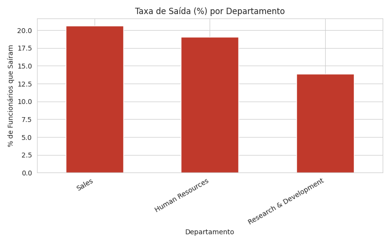
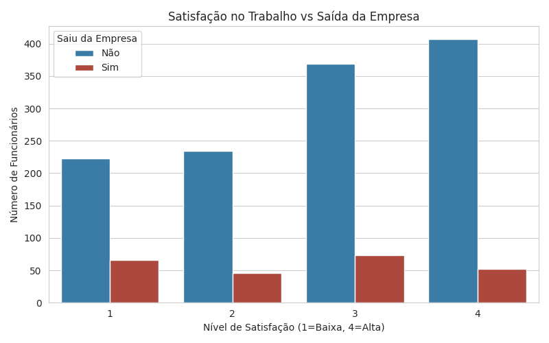
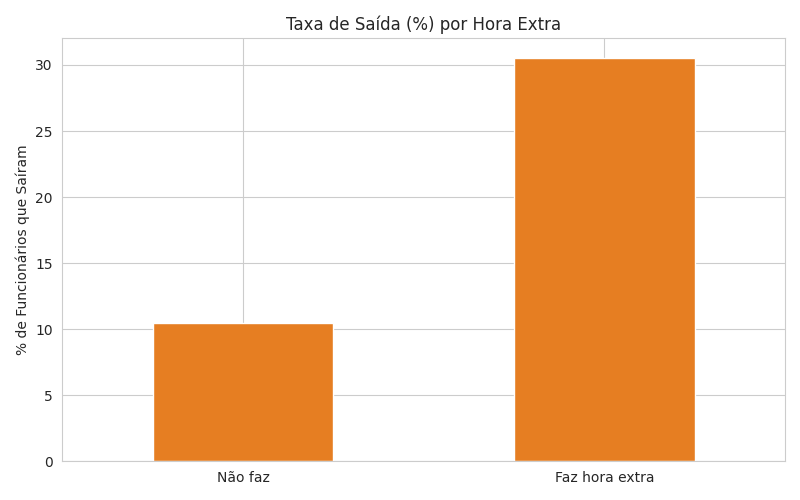

# 📊 People Analytics — Predição de Attrition com Docker

Pipeline de ETL containerizado para análise de rotatividade (attrition) de funcionários, usando o dataset público **IBM HR Analytics Employee Attrition**. O projeto simula um cenário real de People Analytics, onde o time de RH precisa entender **quais fatores mais influenciam a saída de colaboradores** da empresa.


---

## 🎯 Objetivo do projeto

Empresas perdem tempo e dinheiro com rotatividade de funcionários. Este projeto constrói um pipeline de dados que:

1. Extrai dados brutos de RH (idade, cargo, salário, satisfação, hora extra, etc)
2. Limpa e transforma essas informações em um formato analítico
3. Gera visualizações que respondem perguntas de negócio como:
   - Quais departamentos têm maior taxa de saída?
   - Funcionários insatisfeitos saem mais?
   - Fazer hora extra aumenta o risco de desligamento?

Todo o pipeline roda dentro de um **container Docker**, garantindo que qualquer pessoa (recrutador, colega, servidor de produção) consiga reproduzir os mesmos resultados, na mesma versão do Python e das bibliotecas, sem precisar configurar nada manualmente.

---

## 🛠️ Tecnologias utilizadas

- **Python 3.11** — linguagem principal do pipeline
- **Pandas** — extração, limpeza e transformação dos dados
- **Matplotlib & Seaborn** — geração das visualizações
- **Docker** — containerização do pipeline, garantindo portabilidade e reprodutibilidade

---

## 📂 Estrutura do projeto

```
people-analytics-docker/
│
├── data/
│   ├── WA_Fn-UseC_-HR-Employee-Attrition.csv   # dataset original
│   ├── hr_analytics_tratado.csv                # dataset tratado (gerado pelo pipeline)
│   └── charts/                                 # gráficos gerados pelo pipeline
│
├── src/
│   └── etl.py           # pipeline de ETL + geração de gráficos
│
├── Dockerfile            # definição do container
├── requirements.txt       # dependências Python
└── README.md
```

---

## 🚀 Como rodar o projeto

### Pré-requisitos
- [Docker Desktop](https://www.docker.com/products/docker-desktop/) instalado

> ⚠️ **Nota:** o dataset original (`.csv`) não está incluído neste repositório (boa prática para não versionar dados brutos no Git). Antes de rodar o pipeline, baixe o dataset gratuitamente em:
> [IBM HR Analytics Employee Attrition & Performance (Kaggle)](https://www.kaggle.com/datasets/pavansubhasht/ibm-hr-analytics-attrition-dataset)
>
> Depois de baixar, coloque o arquivo `WA_Fn-UseC_-HR-Employee-Attrition.csv` dentro da pasta `data/` do projeto.

### Passo a passo

**1. Clone o repositório**
```bash
git clone https://github.com/BrunoBDados/people-analytics-docker.git
cd people-analytics-docker
```

**2. Construa a imagem Docker**
```bash
docker build -t people-analytics .
```

**3. Execute o pipeline**
```bash
docker run --rm -v ${PWD}/data:/app/data people-analytics
```

O pipeline vai:
- Ler o dataset original
- Limpar e transformar os dados
- Salvar o resultado em `data/hr_analytics_tratado.csv`
- Gerar 3 gráficos dentro de `data/charts/`

---

## 📈 Principais insights

### 1. Taxa de saída por departamento


Alguns departamentos apresentam taxas de rotatividade significativamente mais altas que outros, o que pode indicar problemas de gestão, carga de trabalho ou clima organizacional específicos daquela área.

### 2. Satisfação no trabalho vs saída da empresa


Funcionários com níveis mais baixos de satisfação tendem a apresentar maior propensão a deixar a empresa, reforçando a importância de pesquisas de clima e planos de ação de RH.

### 3. Hora extra vs saída da empresa


Colaboradores que fazem hora extra regularmente apresentam uma taxa de saída consideravelmente maior — um sinal de alerta para políticas de carga de trabalho e prevenção de burnout.

---

## 🧠 Principais aprendizados técnicos

- Estruturação de um pipeline ETL modular (extract, transform, load, visualize)
- Containerização de aplicações Python com Docker
- Uso de volumes Docker para persistir dados gerados fora do container
- Resolução de problemas reais de ambiente (WSL2, Docker Desktop, encoding de arquivos)

---

## 📊 Fonte dos dados

Dataset público: [IBM HR Analytics Employee Attrition & Performance](https://www.kaggle.com/datasets/pavansubhasht/ibm-hr-analytics-attrition-dataset) (Kaggle)

---

## 👤 Autor

**Bruno**
Em transição de carreira para Dados, com background em RH.
🔗 [LinkedIn](https://www.linkedin.com/) | [GitHub](https://github.com/BrunoBDados)